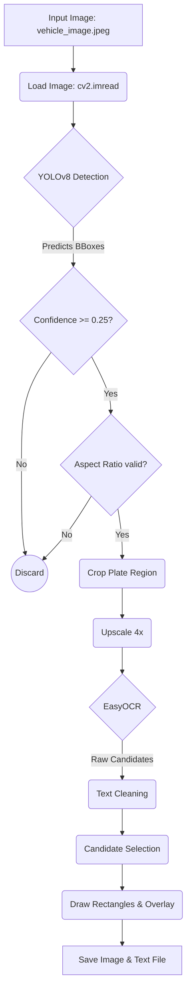

# 🚗 Vehicle License Plate Detection and Recognition System

An automated Computer Vision pipeline that detects vehicle license plates in images and extracts the alphanumeric text using deep learning models (YOLOv8 & EasyOCR).

---

## ⚙️ Complete Project Pipeline & Workflow

The system operates in a sequential **Detection → Recognition** pipeline. Here is the visual flowchart of how an image is processed:

Here is the exact step-by-step breakdown:
### 1. Image Loading 📥
- The system reads the input image (`vehicle_image.jpeg`) from the disk using **OpenCV**.
- The image is loaded into memory as a 3D NumPy array (BGR format).

### 2. License Plate Detection (YOLOv8) 🎯
- The full image is passed through a custom-trained **YOLOv8** object detection model (`license_plate_best.pt`).
- The model scans the image and predicts bounding boxes `(x1, y1, x2, y2)` around potential license plates, along with a confidence score.

### 3. Filtering & Validation 🛡️
To prevent false positives (detecting stickers, signs, or random text as plates), two filters are applied:
- **Confidence Filter:** Detections with a confidence score below `0.25` (25%) are instantly rejected.
- **Aspect Ratio Filter:** License plates have a distinct rectangular shape. The width-to-height ratio is calculated, and any detection outside the `1.5 to 8.0` range is discarded.

### 4. Image Cropping & Upscaling ✂️
- **Cropping:** The validated bounding box coordinates are used to crop out *only* the license plate from the original image (isolating the Region of Interest).
- **Upscaling:** The cropped image is typically very small. To improve OCR accuracy, it is upscaled by **4x** using Bicubic Interpolation (`cv2.INTER_CUBIC`), providing smoother edges for character recognition.

### 5. Optical Character Recognition (EasyOCR) 🔤
- The upscaled, isolated plate image is passed to **EasyOCR** (running on GPU for speed).
- EasyOCR uses a CRAFT network to detect text regions within the plate and a CRNN network to read the characters.
- An **allowlist** is enforced so the OCR only outputs uppercase letters (`A-Z`) and digits (`0-9`), ignoring random symbols.
- A `paragraph=True` flag is used to correctly group multi-line plates (common in India) into a single string.

### 6. Text Cleaning & Candidate Selection 🧹
OCR might return multiple text fragments. The system processes them to find the most accurate license plate number:
- All spaces and non-alphanumeric characters are stripped out.
- The system prioritizes strings that are exactly **7 characters long and contain at least one digit** (a common perfect plate format).
- If a perfect match isn't found, it falls back to selecting the **longest string that contains digits**.

### 7. Annotation & Drawing 🎨
Once the text is successfully extracted, visual feedback is drawn onto the original image using OpenCV:
- A tight **Red Rectangle** is drawn exactly around the license plate.
- A larger **Green Rectangle** is estimated and drawn around the vehicle itself.
- A **Zoomed-in Overlay** of the plate is generated and placed safely above the vehicle box (with collision detection to prevent overlapping overlays if multiple vehicles are detected).
- A solid white background is drawn, and the recognized text is printed clearly in black.

### 8. Exporting Results 💾
- **Visual Output:** The annotated frame is saved to disk as `output_annotated.jpg`.
- **Text Output:** The extracted plate numbers are saved sequentially into a plain text file (`extracted_plates.txt`).
- **Display:** The final annotated image is displayed in a pop-up window for immediate visual verification.

---

## 🛠️ Technologies Used
- **Python 3.x**
- **Ultralytics YOLOv8** (Object Detection)
- **EasyOCR** (Text Extraction)
- **OpenCV** (Image Processing & Annotation)
- **PyTorch** (Deep Learning Backend)
